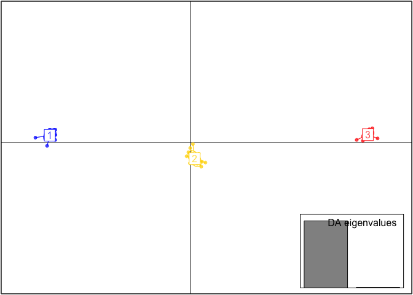
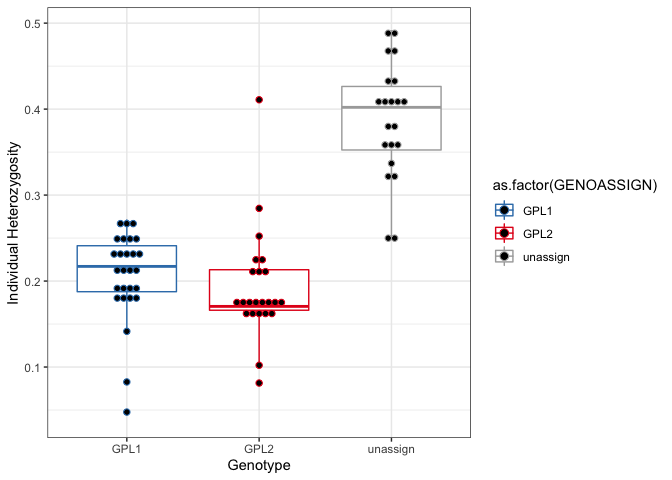

From variants to PCA with Bd Fluidigm data
================

Before running this script I first did a few steps call SNPS from our
data. I aligned the raw sequencing reads to a set of reference alleles
using the program bwa-mem, then called variants using the
haplotype-based caller Freebayes. Variants were then filtered using to
only include variants with a minor allele frequency \> 0.01, quality \>
30, less than 10% missing data, and minimum depth of 5. There are plenty
of tutorials out there to get from raw reads to filtered variants. But
for the sake of time let’s just start with out filtered variants in the
form of a .vcf file.

As always, let’s start with loading the pacakges we will need.

First we read in our variant call file (VCF) and match it to the
metadata table.

``` r
#read in vcf calcualated using freebayes
Bd.VCF <- read.vcfR("PA_Bd_freebayes_trimmed.vcf")
```

    ## Scanning file to determine attributes.
    ## File attributes:
    ##   meta lines: 298
    ##   header_line: 299
    ##   variant count: 129
    ##   column count: 80
    ## Meta line 298 read in.
    ## All meta lines processed.
    ## gt matrix initialized.
    ## Character matrix gt created.
    ##   Character matrix gt rows: 129
    ##   Character matrix gt cols: 80
    ##   skip: 0
    ##   nrows: 129
    ##   row_num: 0
    ## Processed variant: 129
    ## All variants processed

``` r
#read in file with sample metadata
Bd.meta <- read_csv(file = "PA_samples_metadata.csv")
```

    ## 
    ## ── Column specification ────────────────────────────────────────────────────────
    ## cols(
    ##   Sample_ID = col_character(),
    ##   GROUP = col_character(),
    ##   SamplingYear = col_double(),
    ##   SamplingDate = col_character(),
    ##   Sample_Type = col_character(),
    ##   Location = col_character(),
    ##   GENOASSIGN = col_character(),
    ##   Site_code = col_double(),
    ##   Site = col_character(),
    ##   Species_code = col_character(),
    ##   Genus = col_character(),
    ##   species = col_character(),
    ##   Lat = col_double(),
    ##   Lon = col_double()
    ## )

``` r
#join in a meta table based on sample ID
colnames(Bd.VCF@gt)[-1] -> vcf.names
as.data.frame(vcf.names) -> vcf.names
colnames(vcf.names) <- "Sample_ID"
left_join(vcf.names, Bd.meta, by = "Sample_ID") -> vcf.meta
#check
all(colnames(Bd.VCF@gt)[-1] == vcf.meta$Sample)
```

    ## [1] TRUE

Now we are going to turn the VCF into a genlight object for downstream
calcualtions.

``` r
gl.Bd <- vcfR2genlight(Bd.VCF)
ploidy(gl.Bd) <- 2
pop(gl.Bd) <- vcf.meta$GROUP
#get summary of data
gl.Bd
```

    ##  /// GENLIGHT OBJECT /////////
    ## 
    ##  // 71 genotypes,  129 binary SNPs, size: 130.2 Kb
    ##  645 (7.04 %) missing data
    ## 
    ##  // Basic content
    ##    @gen: list of 71 SNPbin
    ##    @ploidy: ploidy of each individual  (range: 2-2)
    ## 
    ##  // Optional content
    ##    @ind.names:  71 individual labels
    ##    @loc.names:  129 locus labels
    ##    @chromosome: factor storing chromosomes of the SNPs
    ##    @position: integer storing positions of the SNPs
    ##    @pop: population of each individual (group size range: 71-71)
    ##    @other: a list containing: elements without names

Now we are going to use a discriminant analysis of principal components
(DAPC) to identify custers within our genetic data using the package
adegenet.

``` r
#this finds the optimal number of clusters for us
grp <- find.clusters(gl.Bd, max.n.clust=10, n.pca = 100, choose.n.clust = F, criterion = "diffNgroup")
 
grp
```

    ## $Kstat
    ##       K=1       K=2       K=3       K=4       K=5       K=6       K=7       K=8 
    ## 149.72690 112.64025  94.55404  92.24078  90.79964  90.67777  90.90175  91.42809 
    ##       K=9      K=10 
    ##  93.02891  93.87948 
    ## 
    ## $stat
    ##      K=3 
    ## 94.55404 
    ## 
    ## $grp
    ##    SERDP_100 SERDP_18_114 SERDP_18_122 SERDP_18_123 SERDP_18_124 SERDP_18_125 
    ##            3            1            1            2            2            1 
    ## SERDP_18_133 SERDP_18_134 SERDP_18_135 SERDP_18_136 SERDP_18_137 SERDP_18_139 
    ##            1            3            1            3            3            3 
    ## SERDP_18_149 SERDP_18_150 SERDP_18_182  SERDP_18_28  SERDP_18_32  SERDP_18_33 
    ##            1            2            3            3            2            3 
    ##  SERDP_18_34  SERDP_18_35  SERDP_18_36  SERDP_18_37  SERDP_18_38  SERDP_18_40 
    ##            1            1            1            3            3            2 
    ##  SERDP_18_41  SERDP_18_42  SERDP_18_44  SERDP_18_63  SERDP_18_68  SERDP_18_70 
    ##            2            1            3            2            1            2 
    ##  SERDP_18_72  SERDP_18_79 SERDP_19_120 SERDP_19_125  SERDP_19_13 SERDP_19_130 
    ##            3            1            1            1            2            1 
    ## SERDP_19_144 SERDP_19_145 SERDP_19_146 SERDP_19_148  SERDP_19_15 SERDP_19_152 
    ##            2            2            2            3            2            3 
    ## SERDP_19_154 SERDP_19_155 SERDP_19_158 SERDP_19_159 SERDP_19_160 SERDP_19_161 
    ##            2            2            2            2            3            2 
    ## SERDP_19_163  SERDP_19_28  SERDP_19_47  SERDP_19_51  SERDP_19_56  SERDP_19_58 
    ##            3            3            1            1            1            1 
    ##  SERDP_19_61  SERDP_19_71  SERDP_19_74  SERDP_19_81  SERDP_19_83  SERDP_19_84 
    ##            3            1            2            2            2            2 
    ##  SERDP_19_85  SERDP_19_86  SERDP_19_90  SERDP_19_91  SERDP_19_93     SERDP_44 
    ##            3            3            1            2            3            1 
    ##     SERDP_45     SERDP_47     SERDP_48     SERDP_54     SERDP_55 
    ##            1            1            1            1            1 
    ## Levels: 1 2 3
    ## 
    ## $size
    ## [1] 27 23 21

``` r
#if we want to see the BIC chart we can see why it chose 3 because it is the "elbow" of the chart.
#grp <- find.clusters(gl.Bd, max.n.clust=10, n.pca = 100, choose.n.clust = T)
#3
```

Let’s run the DAPC with lots of PCs and see what we get.

``` r
#run with 50 PCs 
dapc1 <- dapc(gl.Bd, grp$grp, n.pca=50, n.da=2)

summary(dapc1)
```

    ## $n.dim
    ## [1] 2
    ## 
    ## $n.pop
    ## [1] 3
    ## 
    ## $assign.prop
    ## [1] 1
    ## 
    ## $assign.per.pop
    ## 1 2 3 
    ## 1 1 1 
    ## 
    ## $prior.grp.size
    ## 
    ##  1  2  3 
    ## 27 23 21 
    ## 
    ## $post.grp.size
    ## 
    ##  1  2  3 
    ## 27 23 21

``` r
scatter(dapc1)
```

<!-- -->

Wow those groups are really different\! BUT this is likely due to
overfitting because we are using so many PCs for the calculation. So
lets find out how many PCs we should use

``` r
#then use this to find the optimal number of PCs to use
temp <- optim.a.score(dapc1)
```

<!-- -->

``` r
temp <- optim.a.score(dapc1)
```

<!-- -->

``` r
temp <- optim.a.score(dapc1)
```

<!-- -->

``` r
#we ran it three times and got the same thing. It says our optimal number of PCs is 1 so let's use 2 to retain more information. 

#run the DAPC again now we will just use 2 PCs
dapc1 <- dapc(gl.Bd, grp$grp, n.pca=2, n.da=2)
#to explore split
scatter(dapc1)
```

<!-- -->

Now we get a pretty reasonable spread. Perhaps some of these samples
don’t have a high probability of being group into either 1 or 2. Let’s
check out the probabilities…

``` r
#to see assignment probabilities
assignplot(dapc1)
```

<!-- -->

``` r
#we can see that samples with yellow boxes have lower pobability of being assigned to either group.

#Let us consider as admixed individuals having no more than 99% of probability of membership in a single cluster:
 
unassign <- which(apply(dapc1$posterior,1, function(e) all(e<0.99)))
unassign <- as.numeric(unassign)

#now make a dataframe with the assignments
assign1 <- as_tibble(as.numeric(dapc1$assign))
assign1[unassign,] <- 0

#now let's add this assignment information to our meta file so we can use it in our PCA
vcf.meta <- cbind(vcf.meta, assign=assign1$value)
```

Now we use the assignments to make a PCA

``` r
#calculate PCA
pca <- glPca(gl.Bd, nf = 3)
#plot how much variance is explained by the subsequent PCs
barplot(100*pca$eig/sum(pca$eig), col = heat.colors(50), main="PCA Eigenvalues")
title(ylab="Percent of variance\nexplained", line = 2)
title(xlab="Eigenvalues", line = 1)
```

<!-- -->

Over 50% of the variation in the data is captured in PC1\! Now let’s see
what the PCA looks like.

``` r
pca.scores <- as.data.frame(pca$scores)
cols <- brewer.pal(n_distinct(vcf.meta$assign), "Set1")

p <- ggplot(pca.scores, aes(x=PC2, y=PC1, colour=as.factor(vcf.meta$assign), shape=vcf.meta$Species_code)) + 
  geom_point(size=5) + 
  scale_color_manual(values = c("dark grey",cols[2],cols[1],cols[3])) + 
  scale_shape_manual(values = c(0,2,10,16,3,4,6,7,8,9,15,11,12)) +
  stat_ellipse(aes(x=PC2, y=PC1, group=as.factor(assign1$value)),level = 0.95, size = 1) + 
  geom_hline(yintercept = 0) + 
  geom_vline(xintercept = 0) + 
  theme_bw()

p
```

    ## Too few points to calculate an ellipse

    ## Warning: Removed 1 row(s) containing missing values (geom_path).

<!-- -->

Now we can compare the results we just calcualted with those calculates
by me based on the larger dataset of Nevada and PA sample for our recent
[plos one
paper](https://journals.plos.org/plosone/article?id=10.1371/journal.pone.0261047).

``` r
p2 <- ggplot(pca.scores, aes(x=PC2, y=PC1, colour=as.factor(vcf.meta$GENOASSIGN), shape=vcf.meta$Species_code)) + 
  geom_point(size=5) + 
  scale_color_manual(values = c(cols[2],cols[1],"dark grey")) + 
  scale_shape_manual(values = c(0,2,10,16,3,4,6,7,8,9,15,11,12)) +
  stat_ellipse(aes(x=PC2, y=PC1, group=as.factor(assign1$value)),level = 0.95, size = 1) + 
  geom_hline(yintercept = 0) + 
  geom_vline(xintercept = 0) + 
  theme_bw()

p2
```

    ## Too few points to calculate an ellipse

    ## Warning: Removed 1 row(s) containing missing values (geom_path).

<!-- -->

We can see that the unassigned are the middle group while the GPL1 and
GPL2 genotypes are on each side.

**Run AMOVA to test variation of genetic data based on site or species**

Sourced from this
[tutorial](https://grunwaldlab.github.io/poppr/reference/poppr.amova.html)

``` r
#use the package poppr
pa_genind <- vcfR2genind(Bd.VCF)

#set strata as site and species
pa_strata <- data.frame(cbind(vcf.meta$Site_code,vcf.meta$Species_code, 
paste(vcf.meta$Site_code,vcf.meta$Species_code, sep="_")))
colnames(pa_strata) <- c("Site","Species","Site_Species")
strata(pa_genind) <- pa_strata
pa_genclone <- as.genclone(pa_genind)

#check out sample numbers
table(strata(pa_genclone, ~Site/Species, combine = FALSE))
```

    ##     Species
    ## Site LICL DEFU PSRU PSCR LICA LIPI HYVE ANAM NOVI LISY
    ##    1   13    0    0    3    0    0    0    0    0    2
    ##    5    2    4    1    0    0    0    0    0    0    0
    ##    4    3    0    0    0    6    4    0    0    0    0
    ##    3    1    0    0    2    3    5    2    2    0    0
    ##    2    2    0    0    2    5    0    1    0    1    0
    ##    6    1    0    0    0    2    0    0    0    0    0
    ##    8    0    0    0    0    0    2    0    0    0    0
    ##    7    0    0    0    0    2    0    0    0    0    0

``` r
#run amova
PA_amova <- poppr.amova(pa_genclone, ~Site/Species)
```

    ## 
    ## Found 1290 missing values.
    ## 
    ## 89 loci contained missing values greater than 5%
    ## 
    ## Removing 89 loci: 5_17, 5_30, 5_139, 7_29, 7_41, 15_2, 15_152, 16_74,
    ## 19_41, 19_123, 24_10, 24_19, 24_25, 24_30, 24_73, 24_74, 24_133, 37_40,
    ## 37_47, 39_22, 51_28, 51_49, 51_92, 51_118, 51_134, 59_133, 66_81,
    ## 71_13, 71_33, 71_48, 85_24, 88_75, 88_101, 88_121, 96_98, 107_65,
    ## 108_24, 108_43, 108_122, 112_48, 112_84, 112_104, 112_105, 114_77,
    ## 115_79, 115_97, 117_22, 117_73, 117_110, 120_99, 120_150, 121_27,
    ## 123_66, 127_19, 127_44, 127_121, 129_26, 129_52, 129_62, 129_89,
    ## 129_129, 131_26, 131_47, 131_58, 132_22, 132_46, 132_67, 132_106,
    ## 136_43, 138_20, 138_154, 142_78, 142_101, 142_158, 145_133, 147_90,
    ## 147_106, 153_38, 153_57, 154_57, 154_75, 158_24, 168_128, 168_147,
    ## 169_145, 169_150, 170_48, 184_55, 184_68

    ## Warning in poppr.amova(pa_genclone, ~Site/Species): Data with mixed ploidy or ambiguous allele dosage cannot have within-individual variance calculated until the dosage is correctly estimated.
    ## 
    ##  This function will return the summary statistic, rho (Ronfort et al 1998) but be aware that this estimate will be skewed due to ambiguous dosage. If you have zeroes encoded in your data, you may wish to remove them.
    ##  To remove this warning, use within = FALSE

    ## Warning in is.euclid(xdist): Zero distance(s)

    ## Distance matrix is non-euclidean.

    ## Using quasieuclid correction method. See ?quasieuclid for details.

    ## Warning in is.euclid(distmat): Zero distance(s)

    ## Warning in is.euclid(distances): Zero distance(s)

``` r
#check it out
PA_amova
```

    ## $call
    ## ade4::amova(samples = xtab, distances = xdist, structures = xstruct)
    ## 
    ## $results
    ##                             Df   Sum Sq   Mean Sq
    ## Between Site                 7 120.0918 17.155972
    ## Between samples Within Site 16 203.4515 12.715717
    ## Within samples              47 103.4880  2.201872
    ## Total                       70 427.0313  6.100446
    ## 
    ## $componentsofcovariance
    ##                                              Sigma          %
    ## Variations  Between Site                0.06429862   1.012935
    ## Variations  Between samples Within Site 4.08158410  64.299652
    ## Variations  Within samples              2.20187186  34.687413
    ## Total variations                        6.34775458 100.000000
    ## 
    ## $statphi
    ##                          Phi
    ## Phi-samples-total 0.65312587
    ## Phi-samples-Site  0.64957630
    ## Phi-Site-total    0.01012935

``` r
#run significance test
set.seed(1989)
PA_signif   <- randtest(PA_amova, nrepet = 999)
plot(PA_signif)
```

<!-- -->

``` r
PA_signif
```

    ## class: krandtest lightkrandtest 
    ## Monte-Carlo tests
    ## Call: randtest.amova(xtest = PA_amova, nrepet = 999)
    ## 
    ## Number of tests:   3 
    ## 
    ## Adjustment method for multiple comparisons:   none 
    ## Permutation number:   999 
    ##                         Test        Obs    Std.Obs   Alter Pvalue
    ## 1  Variations within samples 2.20187186 -9.2047420    less  0.001
    ## 2 Variations between samples 4.08158410  7.2712210 greater  0.001
    ## 3    Variations between Site 0.06429862  0.2879502 greater  0.368

From this we can see that a high proportion of variance (64%) is
explained by variations between samples (i.e. species) within Site. and
the p-value is signifcant.

**Calculate heterozygosity among different assigned genotypes**

First, I use the program vcftools to run the following command on my
input vcf:

> ../vcftools –vcf PA\_Bd\_freebayes\_trimmed.vcf –het –out PA\_Bd

This gave me the output called “PA\_Bd.het” which I will read in here.

``` r
#read in
het_all <- read_delim("PA_Bd.het", delim = "\t",
           col_names = c("Sample_ID","ho", "he", "nsites", "f"), skip = 1)
```

    ## 
    ## ── Column specification ────────────────────────────────────────────────────────
    ## cols(
    ##   Sample_ID = col_character(),
    ##   ho = col_double(),
    ##   he = col_double(),
    ##   nsites = col_double(),
    ##   f = col_double()
    ## )

``` r
#join to other metadata
left_join(het_all, vcf.meta, by = "Sample_ID") -> vcf.meta.het
vcf.meta.het <- mutate(vcf.meta.het, ho_calc=1-(ho/nsites))

#plot by genotype
p <- ggplot(vcf.meta.het, aes(x=as.factor(GENOASSIGN), y=ho_calc, color=as.factor(GENOASSIGN))) + 
  geom_boxplot()+
  xlab("Genotype")+
  ylab("Individual Heterozygosity")+
  scale_color_manual(values = c(cols[2],cols[1],"dark grey")) +
  theme_bw()

p + geom_dotplot(binaxis='y', stackdir='center', dotsize=0.5)
```

    ## Bin width defaults to 1/30 of the range of the data. Pick better value with `binwidth`.

<!-- -->

**Calculate pairwise genetic distance and plot vs geographic distance**

``` r
#calculate pairwise genetic distance
pa.dist <- poppr::bitwise.dist(gl.Bd, mat=T)

#calcualte geo dist
pa_pts <- cbind(vcf.meta$Sample_ID,vcf.meta$Lat,vcf.meta$Lon)
colnames(pa_pts) <- c("name","lat","lon")
write.csv(pa_pts, file="pa_geo_pts.csv")
samples_loc_pa <- read.csv("pa_geo_pts.csv", header = T)
#functions for calculating geo dist
ReplaceLowerOrUpperTriangle <- function(m, triangle.to.replace){
   # If triangle.to.replace="lower", replaces the lower triangle of a square matrix with its upper triangle.
   # If triangle.to.replace="upper", replaces the upper triangle of a square matrix with its lower triangle.
   if (nrow(m) != ncol(m)) stop("Supplied matrix must be square.")
   if      (tolower(triangle.to.replace) == "lower") tri <- lower.tri(m)
   else if (tolower(triangle.to.replace) == "upper") tri <- upper.tri(m)
   else stop("triangle.to.replace must be set to 'lower' or 'upper'.")
   m[tri] <- t(m)[tri]
   return(m)
}
GeoDistanceInMetresMatrix <- function(df.geopoints){
   # Returns a matrix (M) of distances between geographic points.
   # M[i,j] = M[j,i] = Distance between (df.geopoints$lat[i], df.geopoints$lon[i]) and
   # (df.geopoints$lat[j], df.geopoints$lon[j]).
   # The row and column names are given by df.geopoints$name.
   GeoDistanceInMetres <- function(g1, g2){
      # Returns a vector of distances. (But if g1$index > g2$index, returns zero.)
      # The 1st value in the returned vector is the distance between g1[[1]] and g2[[1]].
      # The 2nd value in the returned vector is the distance between g1[[2]] and g2[[2]]. Etc.
      # Each g1[[x]] or g2[[x]] must be a list with named elements "index", "lat" and "lon".
      # E.g. g1 <- list(list("index"=1, "lat"=12.1, "lon"=10.1), list("index"=3, "lat"=12.1, "lon"=13.2))
      DistM <- function(g1, g2){
         require("Imap")
         return(ifelse(g1$index > g2$index, 0, gdist(lat.1=g1$lat, lon.1=g1$lon, lat.2=g2$lat, lon.2=g2$lon, units="m")))
      }
      return(mapply(DistM, g1, g2))
   }
   n.geopoints <- nrow(df.geopoints)
   # The index column is used to ensure we only do calculations for the upper triangle of points
   df.geopoints$index <- 1:n.geopoints
   # Create a list of lists
   list.geopoints <- by(df.geopoints[,c("index", "lat", "lon")], 1:n.geopoints, function(x){return(list(x))})
   # Get a matrix of distances (in metres)
   mat.distances <- ReplaceLowerOrUpperTriangle(outer(list.geopoints, list.geopoints, GeoDistanceInMetres), "lower")
   # Set the row and column names
   rownames(mat.distances) <- df.geopoints$name
   colnames(mat.distances) <- df.geopoints$name
   return(mat.distances)
}

#calculate the distance matrix

distance.mat.m.pa <- GeoDistanceInMetresMatrix(samples_loc_pa)

#check the dimensions (these should match)
dim(pa.dist)
```

    ## [1] 71 71

``` r
dim(distance.mat.m.pa)
```

    ## [1] 71 71

``` r
geo_dist_pa <- distance.mat.m.pa[lower.tri(distance.mat.m.pa)]
gen_dist_pa <- pa.dist[lower.tri(pa.dist)]

#for plotting a linear model on the data
gen_dist_dist_pa <- as.dist(pa.dist)
geo_km_dist_dist_pa <- as.dist(distance.mat.m.pa)
pa_lm <- lm(gen_dist_dist_pa ~ geo_km_dist_dist_pa)
#intercept
intercept <- pa_lm$coefficients[1]
#slope for km
slope <- pa_lm$coefficients[2]*1000

#now we can plot
plot(geo_dist_pa/1000, gen_dist_pa, xlab="Geographic Distance (km)", ylab="Genetic Distance")
abline(intercept, slope, col = "gray", lty = 3, lwd=2)
```

<!-- -->

Finally we can run a mantel test to see if geo and genetic distances are
correlated in this system.

``` r
#mantel test
mantel(distance.mat.m.pa, pa.dist)
```

    ## 
    ## Mantel statistic based on Pearson's product-moment correlation 
    ## 
    ## Call:
    ## mantel(xdis = distance.mat.m.pa, ydis = pa.dist) 
    ## 
    ## Mantel statistic r: 0.1334 
    ##       Significance: 0.001 
    ## 
    ## Upper quantiles of permutations (null model):
    ##    90%    95%  97.5%    99% 
    ## 0.0326 0.0459 0.0548 0.0722 
    ## Permutation: free
    ## Number of permutations: 999

Now we can see that there is a very weak correaltion betwen Bd genetic
distance and geographic distance (r = 0.1134).
